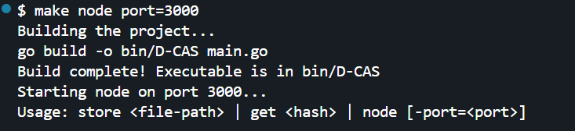
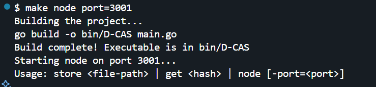
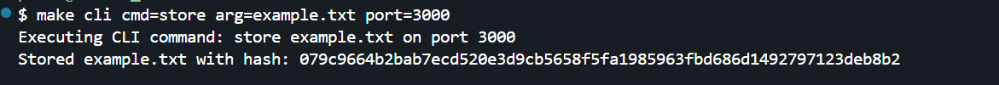
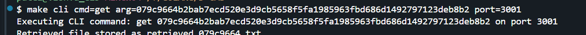

# **🛠️ D-CAS: Distributed Content-Addressable Storage System in Go**  

D-CAS is a **lightweight and scalable distributed storage system** that stores and retrieves files using **content-based addressing (hashing)**. It allows you to start multiple **peer-to-peer (P2P) nodes**, store files across them, and retrieve files using their unique hashes.

---

## **🚀 Features**
✅ **Distributed Storage** – Store files across multiple nodes  
✅ **Content-Addressable** – Retrieve files using SHA-256 hashes  
✅ **P2P Communication** – Nodes communicate over TCP  
✅ **Efficient & Scalable** – Easily add/remove nodes  
✅ **CLI Support** – Interact using simple CLI commands  

---

## **Setup**
Clone the repository:
```sh
git clone https://github.com/CuriousHet/D-CAS.git
cd D-CAS
```

Initialize Go modules:
```sh
go mod init github.com/CuriousHet/D-CAS
go mod tidy
```

Build the project:
```sh
make build
```

---

### **1️⃣ Start Nodes**
You can start multiple nodes on different ports to enable distributed storage.

```sh
make node port=3000
```
```sh
make node port=3001
```

---

### **2️⃣ Store a File**
To store a file in the distributed storage system:
```sh
make cli cmd=store arg=example.txt port=3000
```

---

### **3️⃣ Retrieve a File**
To get a file using its **hash**:
```sh
make cli cmd=get arg=<hash> port=3001
```

---

## **🔧 Available Makefile Commands**
| Command | Description |
|---------|-------------|
| `make build` | Compiles the project |
| `make node port=3000` | Starts a node on a given port |
| `make cli cmd=store arg=file.txt port=3000` | Stores a file in the network |
| `make cli cmd=get arg=<hash> port=3001` | Retrieves a file using its hash |
| `make test` | Runs test cases |
| `make fmt` | Formats the code |
| `make clean` | Removes build artifacts |


---

## **💡 Future Improvements**
🔹 Support for **data replication**  
🔹 Advanced **peer discovery**  
🔹 Web-based **UI for file management**  

---










